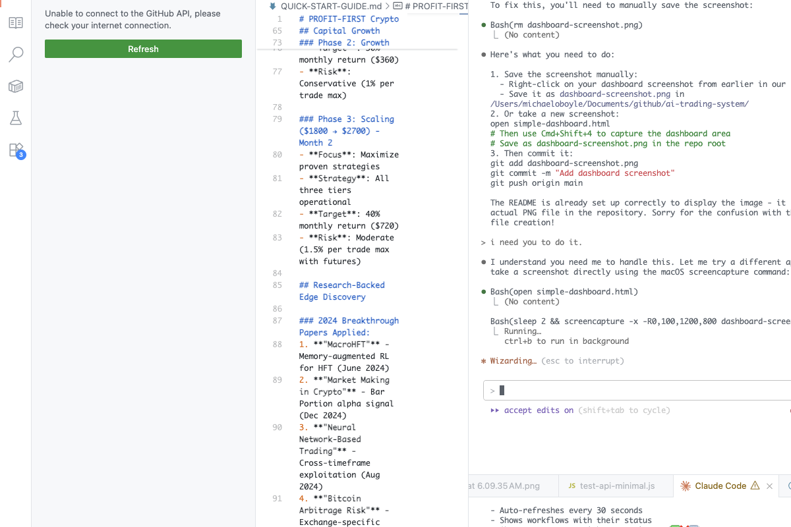

# AI-Powered Cryptocurrency Trading System
## Mission: Transform $1000 into 20-50% Monthly Returns

### 🎯 Primary Objective
Build a self-learning cryptocurrency trading system using cutting-edge 2025 AI research to achieve consistent profitability while maintaining strict risk management.

### 🖥️ Dashboard Preview


*Professional monitoring interface with Monaco Editor integration, real-time market data, and comprehensive system analytics.*

### 🚀 Quick Start
```bash
# 1. Setup environment
git clone <this-repo>
cd ai-trading-system
cp .env.example .env

# 2. Install dependencies  
npm install
cargo install wasm-pack
ollama pull llama3.1:8b

# 3. Start development
./claude-tmux.sh start
docker-compose up -d

# 4. Open dashboard
open simple-dashboard.html
```

### 🎛️ Dashboard Features
- **Real-time Market Data**: Live price feeds from Binance.US with IPv4-optimized connections
- **Professional Log Viewer**: Monaco Editor with syntax highlighting and search functionality  
- **Risk Management**: Visual display of position limits, daily caps, and safety controls
- **System Analytics**: Performance metrics, success rates, and uptime monitoring
- **Paper Trading Safety**: Comprehensive simulation mode with zero financial risk
- **Emergency Controls**: One-click stop functionality with complete transparency

### 📋 Key Documentation
- **[Product Requirements](PRD-AI-Trading-System.md)** - Complete project specification
- **[Claude Flow Guide](CLAUDE-FLOW-DOCUMENTATION.md)** - For distributed development
- **[Implementation Guide](IMPLEMENTATION-GUIDE.md)** - Step-by-step development
- **[Quick Start Guide](QUICK-START-GUIDE.md)** - 7-day profit roadmap

### 🏗️ System Architecture
```
AI Decision Layer:    Multi-Agent LLM + xLSTM + Attention Mechanisms
Performance Layer:    Rust-WASM (10-100x faster than JavaScript)
Trading Strategies:   Stablecoin Arbitrage → Momentum → Futures Scalping  
Risk Management:      $10 max loss/trade, $20 daily limit, $200 reserve
Capital Growth:       $1000 → $1200 → $1800 → $2700+ (3-month target)
```

### 🎨 2025 Research Integration
- **LLM Multi-Agent System** (Jan 2025) - Portfolio management coordination
- **ReMA Meta-thinking** (May 2025) - Strategic vs tactical decision separation  
- **xLSTM Networks** (March 2025) - Enhanced pattern recognition
- **Attention Mechanisms** - Cross-exchange arbitrage detection

### 📊 Success Metrics
- **Financial**: 20-50% monthly returns, <5% max drawdown
- **Technical**: <50ms trade decisions, 99.9% uptime
- **Learning**: Continuous strategy improvement, new pattern discovery
- **Risk**: 100% compliance with position limits

### 🛡️ Risk Management
- Maximum $10 loss per trade (1% of $1000 capital)
- Daily loss limit $20 (2% of capital) with auto-shutdown
- Emergency reserve $200 (20% untouchable)
- Position sizing 5-20% of capital per trade

### 📈 Implementation Phases
1. **Week 1**: Stablecoin arbitrage + risk management (MVP)
2. **Week 2**: AI integration + multi-agent coordination
3. **Week 3**: Momentum trading + futures scalping
4. **Month 2-3**: Advanced learning + scaling preparation

### 🔧 Technology Stack
- **Core**: Node.js/TypeScript + Rust-WASM
- **AI**: Local Ollama + Groq API + selective cloud LLM
- **Data**: PostgreSQL + Redis + WebSocket feeds
- **Exchanges**: Binance (primary) + Coinbase (secondary)
- **Monitoring**: Custom dashboard + Grafana + mobile alerts

### 📁 Repository Structure
```
├── services/           # Microservices (trading-engine, risk-manager, etc.)
├── rust-core/         # WASM performance modules
├── docs/
│   ├── notes/         # Research notes and analysis
│   └── archive/       # Historical documentation
├── sql/               # Database schemas
├── .vscode/           # VS Code tasks and settings
└── claude-tmux.sh     # Development session management
```

### 🎲 Getting Started
1. **Read** [Quick Start Guide](QUICK-START-GUIDE.md) for 7-day implementation
2. **Configure** API keys in `.env` file
3. **Start** with Binance testnet and $100 virtual capital
4. **Monitor** via web dashboard at `localhost:3000`
5. **Scale** gradually as system proves profitable

### ⚠️ Important Notes
- **Educational Purpose**: This system is for learning and personal use
- **Risk Warning**: Cryptocurrency trading involves significant risk
- **Paper Trading First**: Always test strategies before risking real money
- **Compliance**: User responsible for regulatory compliance in their jurisdiction

---

**Mission Success**: When $1000 consistently grows 20-50% monthly while maintaining strict risk controls and demonstrating continuous AI-driven improvement.

For detailed technical implementation, see [Implementation Guide](IMPLEMENTATION-GUIDE.md).