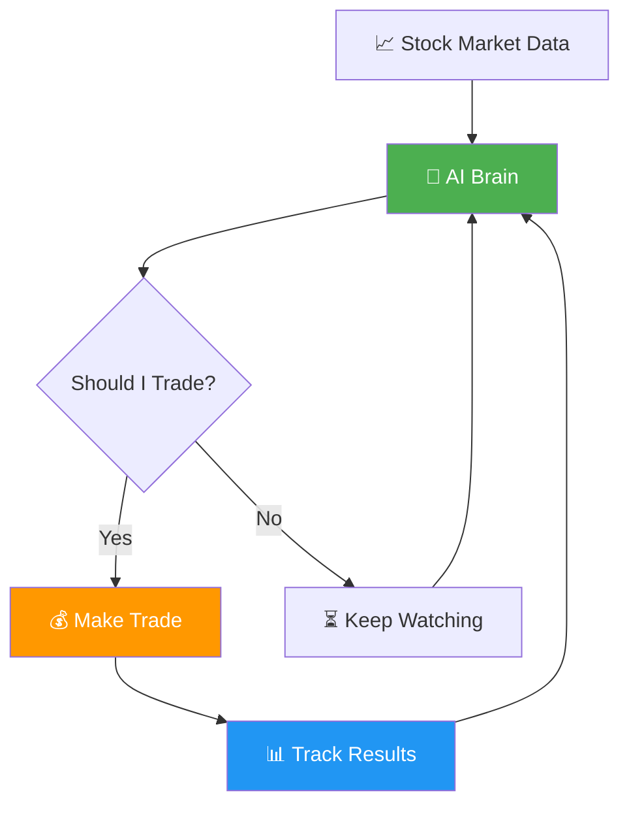
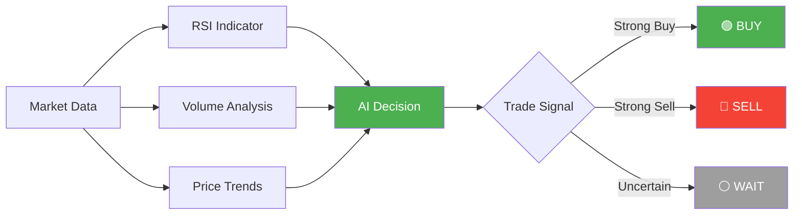
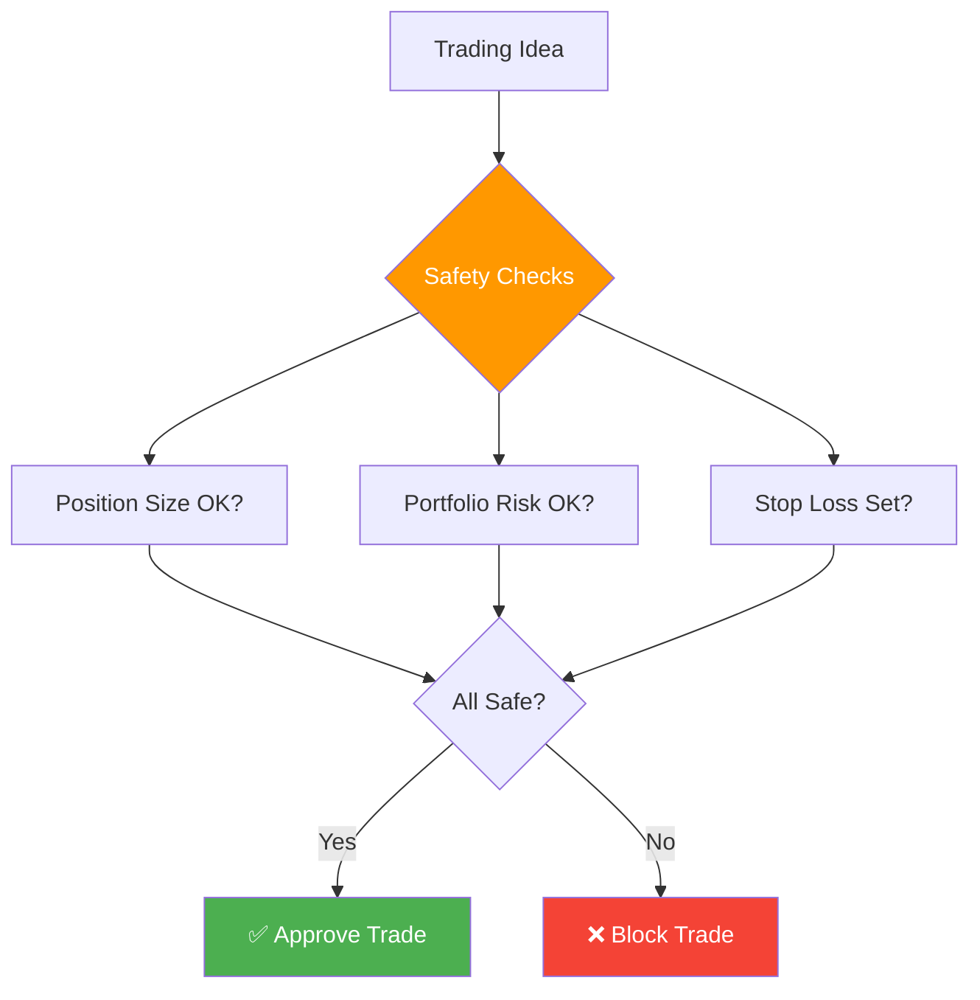
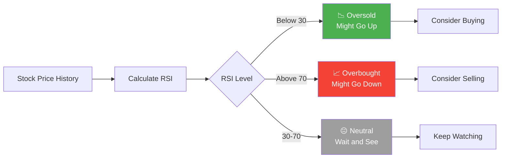
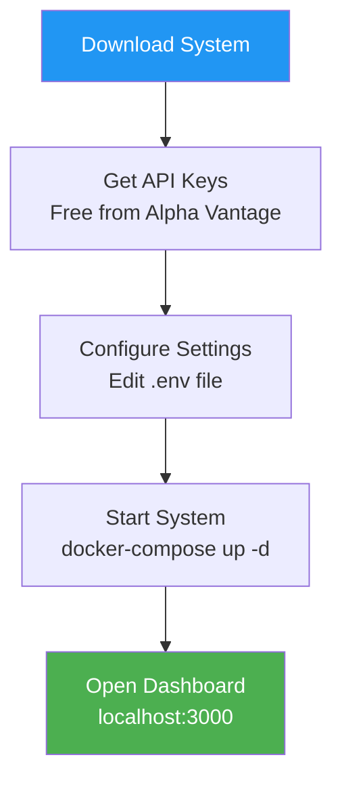
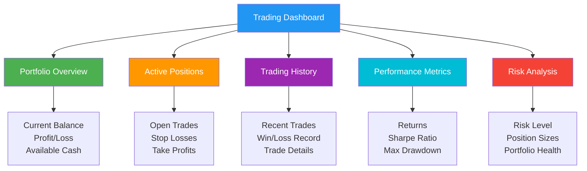
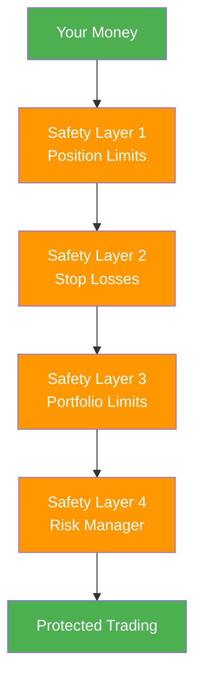
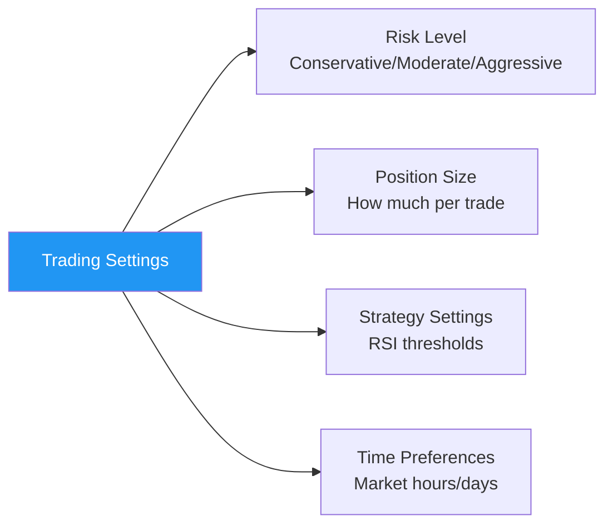
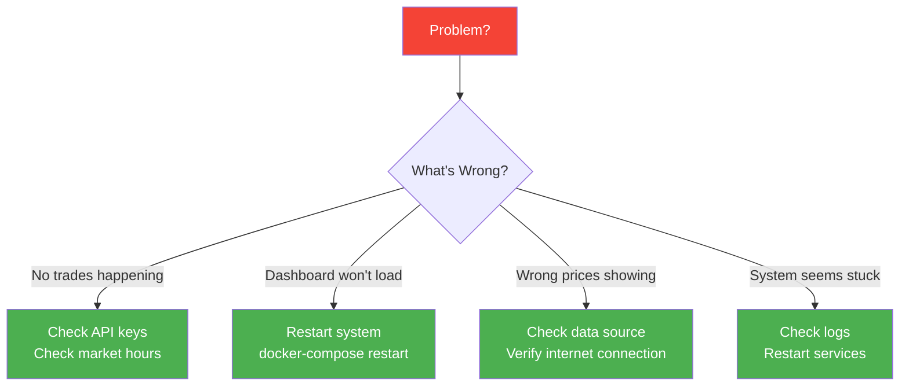

# 🤖 AI Trading System - User Guide

*A beginner-friendly guide to understanding and using your AI trading system*

## 🌟 What is This System?

Think of this AI trading system as your personal financial assistant that watches the stock market 24/7. Just like how a GPS helps you navigate by analyzing traffic patterns and finding the best route, this system analyzes market patterns to help make trading decisions.

The system is designed to be **safe** and **educational** - it starts in "paper trading" mode, which means it practices with fake money while you learn how it works.

## 🎯 How It Works (Simple Overview)

### The Process in Plain English:
1. **📊 Data Collection**: The system continuously watches stock prices, just like checking the weather
2. **🧠 Analysis**: The AI "brain" looks for patterns and opportunities
3. **🛡️ Safety Check**: A risk manager ensures trades are safe
4. **💼 Decision**: The system decides to buy, sell, or wait
5. **📈 Tracking**: All activity is monitored and recorded

## 🏗️ System Components

### 1. The AI Brain (Trading Engine)
**What it does:** Makes the actual trading decisions
**Think of it as:** A experienced trader who never sleeps, never gets emotional, and follows strict rules

### 2. The Safety Guard (Risk Manager)
**What it does:** Prevents big losses and manages how much money to risk
**Think of it as:** A financial advisor who makes sure you never bet more than you can afford

### 3. The Data Collector (Market Data Service)
**What it does:** Gathers real-time stock market information
**Think of it as:** A news reporter who constantly updates you on market conditions

### 4. The Dashboard (Web Interface)
**What it does:** Shows you what's happening in a visual, easy-to-understand way
**Think of it as:** Your trading control panel - like the dashboard in your car

## 📊 Understanding the Trading Strategy

The system primarily uses a strategy called "Enhanced RSI" - here's what that means in simple terms:

### RSI (Relative Strength Index) Explained

**Simple Analogy:** Imagine RSI as a "temperature gauge" for stocks:
- **Cold (Below 30)**: Stock might be "underpriced" - good time to buy
- **Hot (Above 70)**: Stock might be "overpriced" - good time to sell  
- **Comfortable (30-70)**: Stock is fairly priced - wait for better opportunity

## 🚀 Getting Started

### Step 1: Setup (5 minutes)

### Step 2: First Look at Dashboard
Your dashboard shows:
- **📈 Current Portfolio Value**: How much your "fake money" is worth
- **📊 Recent Trades**: What the system has been doing
- **⚡ Live Signals**: Current market opportunities
- **🎯 Performance**: How well the system is doing

### Step 3: Paper Trading (Recommended Start)
The system starts in "paper trading" mode - this means:
- ✅ Uses fake money ($10,000 to start)
- ✅ Makes real trading decisions
- ✅ Tracks real performance
- ❌ No real money at risk

## 📈 Understanding Your Dashboard

### Main Sections:

### Key Metrics Explained:

**📊 Profit/Loss (P&L)**
- Green = Making money 💰
- Red = Losing money 📉
- Shows both $ amount and % return

**🎯 Win Rate**  
- Percentage of trades that made money
- Good systems: 55-70%
- Higher isn't always better!

**📉 Max Drawdown**
- Largest loss from peak to valley
- Shows worst-case scenario
- Lower is better (less risky)

## 🛡️ Safety Features

### Built-in Protection:

**Default Safety Rules:**
- 💰 Maximum 2% risk per trade
- 📊 Maximum 5% total portfolio risk  
- 🏦 Maximum 10% in any single stock
- ⚠️ Automatic stop-losses on all trades

## 🎛️ Customization Options

### Basic Settings You Can Change:

### Risk Levels:
- **🛡️ Conservative**: Lower risk, steadier returns
- **⚖️ Moderate**: Balanced approach (recommended)
- **🚀 Aggressive**: Higher risk, potential for bigger gains

## 📚 Learning Resources

### Understanding Your Results:

**Good Signs:**
- ✅ Consistent small profits over time
- ✅ Low drawdown (< 10%)
- ✅ Win rate above 50%
- ✅ Steady upward trend

**Warning Signs:**
- ⚠️ Large sudden losses
- ⚠️ Many consecutive losing trades
- ⚠️ High drawdown (> 20%)
- ⚠️ Erratic performance

### Market Concepts Made Simple:

**Bull Market** 🐂: Prices generally going up
**Bear Market** 🐻: Prices generally going down  
**Volatility** 📊: How much prices jump around
**Volume** 📈: How many shares are being traded

## 🔧 Troubleshooting

### Common Issues:

### Getting Help:
1. 📋 Check the system logs first
2. 🔄 Try restarting the system
3. 📖 Review this guide
4. 💬 Ask questions in the GitHub issues

## ⚠️ Important Disclaimers

### Remember:
- 🎓 **This is for learning** - Start with paper trading
- 📈 **Past performance ≠ future results** - Markets are unpredictable  
- 💡 **Understand before investing** - Never risk money you can't afford to lose
- 📞 **Get professional advice** - Consult financial advisors for real money decisions

### Legal Notice:
This system is for educational purposes only. Always:
- Check your local financial regulations
- Understand tax implications
- Consider professional financial advice
- Never invest more than you can afford to lose

---

## 🎯 Quick Start Checklist

- [ ] ✅ System installed and running
- [ ] 📊 Dashboard accessible at localhost:3000
- [ ] 🎮 Paper trading mode confirmed
- [ ] 📋 API keys configured
- [ ] 📈 First trades observed
- [ ] 📖 Dashboard understood
- [ ] 🛡️ Safety settings reviewed
- [ ] 📚 This guide read completely

**Ready to start your AI trading journey!** 🚀

*Built with ❤️ by Michael O'Boyle and Claude Code*