# 🤖 AI Trading System - Executive Overview
*A Plain English Guide to Our Automated Trading Platform*

---

## 📝 What Is This System?

Imagine having a team of expert traders working for you 24/7, never getting tired, never getting emotional, and always following the rules you set. That's essentially what this AI Trading System does - it's like having your own personal Wall Street trading floor, but it all runs automatically on your computer.

---

## 🎯 The Big Picture - Why This Matters

### **The Problem We're Solving**

Most people who try to trade stocks face these challenges:
- 😰 **Emotional decisions** - Fear and greed lead to bad trades
- ⏰ **Time constraints** - Can't watch markets all day
- 📚 **Information overload** - Too much data to process
- 🎯 **Lack of discipline** - Hard to stick to a strategy
- 💸 **Costly mistakes** - Human errors are expensive

### **Our Solution**

This system automates everything, removing human weaknesses while leveraging computer strengths:

```mermaid
graph LR
    subgraph "Traditional Trading"
        A[👤 Human Trader] --> B[😰 Emotions]
        B --> C[❌ Bad Decisions]
        C --> D[💸 Losses]
    end
    
    subgraph "AI Trading System"
        E[🤖 AI System] --> F[📊 Pure Data]
        F --> G[✅ Logic-Based Decisions]
        G --> H[💰 Consistent Results]
    end
    
    style D fill:#FF5252,color:#fff
    style H fill:#4CAF50,color:#fff
```

---

## 🏗️ How Does It Work?

Think of the system like a sophisticated assembly line in a factory, where each station has a specific job:

```mermaid
flowchart TB
    subgraph "The Trading Assembly Line"
        A[📡 Data Collection<br/>Gathering Market Information] 
        A --> B[🧠 Analysis Engine<br/>Making Sense of Data]
        B --> C[🎯 Decision Making<br/>Buy, Sell, or Hold?]
        C --> D[🛡️ Risk Check<br/>Is This Safe?]
        D --> E[💱 Trade Execution<br/>Place the Order]
        E --> F[📊 Performance Tracking<br/>How Are We Doing?]
        F --> A
    end
    
    style A fill:#2196F3,color:#fff
    style B fill:#9C27B0,color:#fff
    style C fill:#FF9800,color:#fff
    style D fill:#F44336,color:#fff
    style E fill:#4CAF50,color:#fff
    style F fill:#00BCD4,color:#fff
```

### **Step-by-Step Process**

1. **📡 Data Collection Station**
   - Watches stock prices in real-time
   - Gathers news and market information
   - Tracks trading volumes and patterns
   - *Like having 100 people watching different screens simultaneously*

2. **🧠 Analysis Engine**
   - Calculates if stocks are overpriced or underpriced
   - Identifies trends and patterns
   - Predicts likely price movements
   - *Like a team of analysts working together*

3. **🎯 Decision Making**
   - Decides whether to buy, sell, or wait
   - Determines how much to invest
   - Times entries and exits precisely
   - *Like a seasoned trader making calculated decisions*

4. **🛡️ Risk Management**
   - Ensures no single trade can cause major losses
   - Diversifies investments automatically
   - Sets stop-losses to limit downside
   - *Like having a safety net under a trapeze*

5. **💱 Trade Execution**
   - Places orders instantly when conditions are met
   - Gets best available prices
   - Handles all the technical details
   - *Like having a broker execute trades for you*

6. **📊 Performance Tracking**
   - Monitors all positions in real-time
   - Calculates profits and losses
   - Generates detailed reports
   - *Like having an accountant track everything*

---

## 💡 Key Features Explained

### **Paper Trading Mode (Practice Mode)**

Before using real money, the system can practice with "fake" money:

```mermaid
graph TB
    A[🎮 Practice Mode] --> B[📝 Learn System]
    B --> C[🧪 Test Strategies]
    C --> D[📊 See Results]
    D --> E[✅ Build Confidence]
    E --> F[💰 Go Live When Ready]
    
    style A fill:#2196F3,color:#fff
    style F fill:#4CAF50,color:#fff
```

**Why This Matters:** Just like pilots train in flight simulators before flying real planes, you can test the system without risking actual money.

### **The Trading Strategy (RSI Method)**

The system uses a proven method called RSI (Relative Strength Index) - think of it like a thermometer for stocks:

```mermaid
graph LR
    subgraph "RSI Trading Thermometer"
        A[🌡️ RSI Indicator]
        B[🔥 Too Hot<br/>RSI > 70<br/>Stock Overbought]
        C[👍 Just Right<br/>RSI 30-70<br/>Normal Range]
        D[❄️ Too Cold<br/>RSI < 30<br/>Stock Oversold]
    end
    
    B --> E[📉 SELL Signal<br/>Price Likely to Drop]
    C --> F[⏸️ HOLD<br/>Wait for Better Opportunity]
    D --> G[📈 BUY Signal<br/>Price Likely to Rise]
    
    style B fill:#F44336,color:#fff
    style C fill:#FF9800,color:#fff
    style D fill:#2196F3,color:#fff
```

**Real Example:** 
- If Apple stock gets "too hot" (everyone's buying, price too high), the system sells
- If it gets "too cold" (everyone's selling, price too low), the system buys
- This is like buying winter coats in summer when they're cheap!

### **Risk Management - Your Safety Net**

The system has multiple safety features to protect your money:

**Think of it like driving a car with:**
- Seatbelts (stop-losses)
- Airbags (position limits)
- Anti-lock brakes (portfolio balance)
- Collision detection (risk monitoring)

---

## 📊 Understanding the Dashboard

The system includes a control panel where you can see everything happening:

```mermaid
graph TB
    subgraph "Your Trading Dashboard"
        A[📊 Portfolio Overview<br/>Total Value & Performance]
        B[📈 Current Positions<br/>What You Own]
        C[📉 Recent Trades<br/>Buy/Sell History]
        D[💹 Market Analysis<br/>Current Opportunities]
        E[⚠️ Risk Metrics<br/>Safety Indicators]
        F[📱 Alerts & Notifications<br/>Important Updates]
    end
    
    G[👤 You] --> H[🖥️ Web Browser]
    H --> A
    H --> B
    H --> C
    H --> D
    H --> E
    H --> F
    
    style G fill:#4CAF50,color:#fff
    style A fill:#2196F3,color:#fff
```

### **What You'll See:**

1. **Portfolio Value** - How much your investments are worth
2. **Daily Performance** - Are you making or losing money today?
3. **Open Positions** - Which stocks you currently own
4. **Trade History** - Record of all buy/sell decisions
5. **Risk Status** - Green = Safe, Yellow = Caution, Red = High Risk

---

## 💰 The Economics - Costs and Returns

### **Operating Costs**

### **Potential Returns**

Based on historical testing (remember: past performance doesn't guarantee future results):

**For Context:**
- Savings Account: 0.5% per year
- Stock Market Average: 10% per year
- Our System Target: 15% per year
- Risk Level: Moderate (similar to stock market)

---

## 🚀 Getting Started - Your Journey

### **Timeline Expectations**

| Phase | Duration | What Happens |
|-------|----------|--------------|
| **Setup** | 1-2 hours | Install and configure system |
| **Learning** | 2-4 weeks | Paper trading and understanding |
| **Testing** | 1-2 months | Small real money tests |
| **Scaling** | 3-6 months | Gradually increase investment |
| **Mature Operation** | Ongoing | Fully automated trading |

---

## ⚠️ Important Considerations

### **What This System IS:**
✅ An automated helper for trading decisions  
✅ A risk management tool  
✅ A time-saving automation  
✅ A disciplined approach to investing  
✅ A learning platform for markets  

### **What This System IS NOT:**
❌ A get-rich-quick scheme  
❌ A guarantee of profits  
❌ A replacement for financial planning  
❌ Suitable for money you can't afford to lose  
❌ A "set and forget forever" solution  

### **Risk Disclosure Box**

```mermaid
graph TB
    A[⚠️ IMPORTANT RISKS] --> B[Market Risk<br/>Stocks can go down]
    A --> C[Technology Risk<br/>Systems can fail]
    A --> D[Strategy Risk<br/>Methods may not work]
    A --> E[Regulatory Risk<br/>Rules can change]
    
    B --> F[Never invest money<br/>you cannot afford to lose]
    C --> F
    D --> F
    E --> F
    
    style A fill:#F44336,color:#fff
    style F fill:#FF9800,color:#fff
```

---

## 🎯 Success Metrics - How to Measure Performance

### **Key Performance Indicators (KPIs)**

### **Reading Your Reports**

**Daily Report Shows:**
- 💰 Account Balance - Total value of investments
- 📈 Today's Profit/Loss - Money made or lost today
- 🎯 Active Trades - Current stock positions
- 📊 Performance Chart - Visual progress over time

**Monthly Report Shows:**
- 📈 Total Return - Percentage gain/loss for month
- 🏆 Best Trade - Most profitable transaction
- 📉 Worst Trade - Biggest loss (learning opportunity)
- 📊 Statistics - Detailed performance metrics

---

## 🤝 Support and Maintenance

### **What You Need to Do**

```mermaid
flowchart LR
    A[👤 Your Responsibilities] --> B[🔍 Check Weekly<br/>Review performance]
    A --> C[📊 Monthly Review<br/>Assess strategy]
    A --> D[🔧 Quarterly Update<br/>Adjust settings]
    A --> E[💰 Annual Planning<br/>Set goals]
    
    F[🤖 System Handles Everything Else Automatically]
    
    style A fill:#4CAF50,color:#fff
    style F fill:#2196F3,color:#fff
```

### **When to Take Action**

| Situation | What to Do |
|-----------|------------|
| **Losing money for 2 weeks** | Review settings, maybe pause |
| **Big market news** | Check if system responding appropriately |
| **Technology updates available** | Install when convenient |
| **Annual tax time** | Export reports for accountant |

---

## 💡 Frequently Asked Questions

### **Q: How much money do I need to start?**
**A:** We recommend starting with $1,000 for meaningful results, but you can paper trade with $0 to learn.

### **Q: Can I lose all my money?**
**A:** While unlikely due to safety features, yes, all trading involves risk of loss.

### **Q: How much time does this require?**
**A:** After setup, about 15 minutes per week to review performance.

### **Q: What if the system stops working?**
**A:** It has automatic safety stops and will halt trading if problems detected.

### **Q: Can I override the system's decisions?**
**A:** Yes, you maintain full control and can intervene anytime.

### **Q: Is this legal?**
**A:** Yes, automated trading is completely legal for personal use.

### **Q: Do I need to be a computer expert?**
**A:** No, basic computer skills are sufficient. If you can use email and web browsers, you can use this.

### **Q: What about taxes?**
**A:** The system provides reports for tax purposes, but consult your tax advisor.

---

## 🎓 Next Steps

```mermaid
graph TD
    A[📚 Read This Guide] --> B[💬 Ask Questions]
    B --> C[🔧 Install System]
    C --> D[🎮 Start Paper Trading]
    D --> E[📊 Review Results]
    E --> F{Ready for Real Money?}
    F -->|Yes| G[💰 Start Small]
    F -->|No| D
    G --> H[📈 Scale Gradually]
    H --> I[🎯 Achieve Goals]
    
    style A fill:#4CAF50,color:#fff
    style I fill:#FFD700,color:#000
```

### **Your Action Items:**
1. ✅ Finish reading this guide
2. ✅ Decide if this fits your investment goals
3. ✅ Set up a demo account
4. ✅ Practice for at least 1 month
5. ✅ Start small with real money
6. ✅ Scale based on comfort and results

---

## 📞 Getting Help

**When You Need Support:**
- 📧 **Email**: Check documentation first
- 💬 **Community**: Join user forums
- 📚 **Documentation**: Comprehensive guides available
- 🎥 **Videos**: Tutorial walkthroughs
- 🤝 **Professional Help**: Consultant available for setup

---

## 🏆 Success Story Example

> **Sarah's Journey:**
> - Month 1: Installed system, paper traded, learned the interface
> - Month 2: Started with $1,000, made 2% return
> - Month 6: Increased to $5,000, averaging 1.5% monthly
> - Year 1: Portfolio at $5,750, gained confidence
> - Year 2: Scaled to $20,000, system running smoothly
> - Today: Manages $50,000 portfolio, 15 minutes weekly oversight

---

## 🎯 Final Thoughts

This AI Trading System is like having a sophisticated investment team working for you around the clock. It's not magic - it's technology applying proven trading strategies with discipline and consistency that humans struggle to maintain.

**Remember:**
- 🐢 Slow and steady wins the race
- 📚 Knowledge reduces risk
- 💪 Discipline beats emotion
- 🛡️ Protection before profits
- 📈 Time in market beats timing the market

The system is a tool to help you achieve your financial goals more efficiently, not a guarantee of wealth. Use it wisely, monitor regularly, and never invest more than you can afford to lose.

---

*This document prepared for non-technical readers to understand the AI Trading System's capabilities, benefits, and risks in plain English.*

**Version:** 1.0  
**Last Updated:** September 2025  
**Next Review:** December 2025

---