# 🎨 AI Trading System Visual Guide
*Understanding Our Platform Through Pictures and Diagrams*

---

## 🏠 System Overview - The Complete Picture

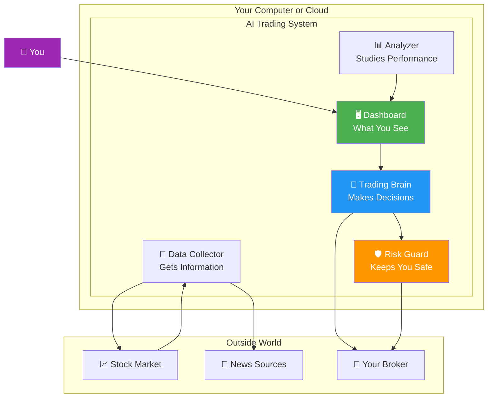

---

## 📱 What You See - The Dashboard

```mermaid
graph LR
    subgraph "Trading Dashboard Layout"
        subgraph "Top Section"
            A[💰 Total Value<br/>$10,000]
            B[📈 Today's Gain<br/>+$150 (+1.5%)]
            C[📊 This Month<br/>+$450 (+4.5%)]
        end
        
        subgraph "Middle Section"
            D[Current Holdings]
            E[Apple: 10 shares]
            F[Microsoft: 5 shares]
            G[Tesla: 3 shares]
        end
        
        subgraph "Bottom Section"
            H[Recent Activity]
            I[Bought AAPL @ $150]
            J[Sold GOOGL @ $2800]
            K[Risk Level: LOW ✅]
        end
    end
```

---

## 🔄 How Trading Decisions Are Made

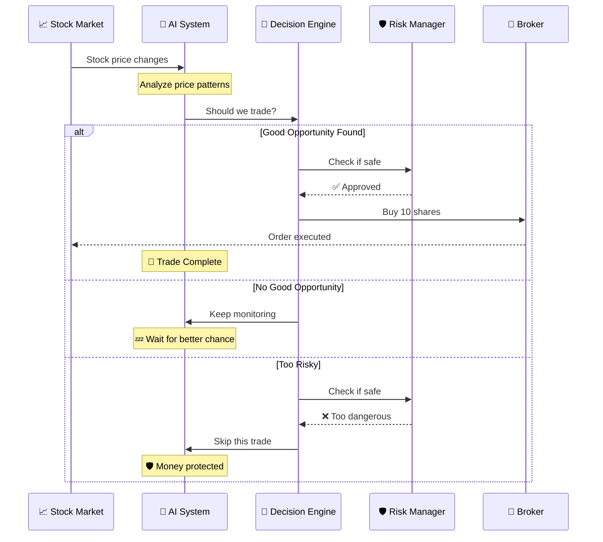

---

## 📊 Performance Over Time

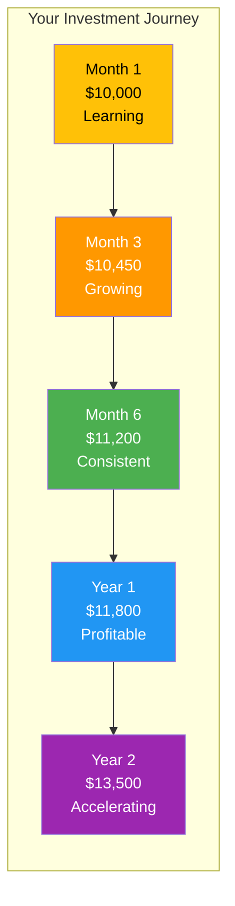

---

## 🎯 Trading Strategy Visualization

### **The RSI Strategy - When to Buy and Sell**

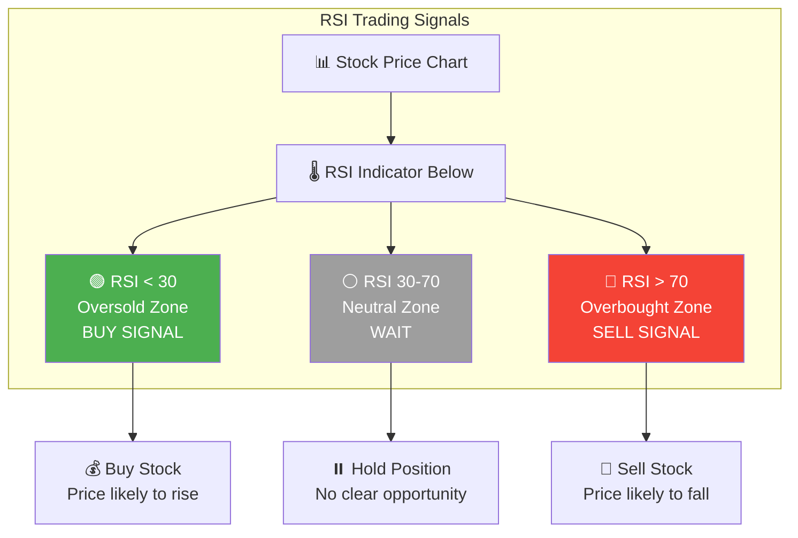

---

## 🛡️ Risk Management in Action

```mermaid
flowchart TD
    A[💰 $10,000 Portfolio] --> B{Risk Rules}
    
    B --> C[Rule 1: Position Size<br/>Max $1,000 per stock<br/>(10% limit)]
    B --> D[Rule 2: Stop Loss<br/>Sell if losing $200<br/>(2% protection)]
    B --> E[Rule 3: Diversification<br/>At least 5 different stocks<br/>(Spread risk)]
    B --> F[Rule 4: Daily Limit<br/>Max $500 risk per day<br/>(5% daily cap)]
    
    C --> G[✅ Protected Portfolio]
    D --> G
    E --> G
    F --> G
    
    H[Example Trade]
    H --> I[Buy Apple: $1,000 ✅<br/>Stop Loss: $980 ✅<br/>Portfolio: 10% ✅]
    
    J[Risky Trade Blocked]
    J --> K[Buy Tesla: $3,000 ❌<br/>Too large!<br/>System blocks trade]
    
    style A fill:#4CAF50,color:#fff
    style G fill:#2196F3,color:#fff
    style K fill:#F44336,color:#fff
```

---

## 📈 Typical Day in the Life of Your System

```mermaid
timeline
    title A Day of Automated Trading
    
    9:00 AM : System Wakes Up
            : Checks overnight news
            : Reviews positions
    
    9:30 AM : Market Opens
            : Begins monitoring prices
            : Analyzes opportunities
    
    10:15 AM : First Signal
             : RSI shows Apple oversold
             : Buys 10 shares
    
    12:00 PM : Continuous Monitoring
             : No new opportunities
             : Positions stable
    
    2:30 PM : Sell Signal
            : Microsoft hits target
            : Sells for 3% profit
    
    3:45 PM : End of Day Check
            : Reviews all positions
            : Sets overnight alerts
    
    4:00 PM : Market Closes
            : Generates daily report
            : Sends summary email
    
    6:00 PM : You Check Results
            : Review dashboard
            : Made $75 today!
```

---

## 💰 Money Flow Visualization

```mermaid
graph TD
    A[Your Investment: $10,000] --> B[AI Trading System]
    
    B --> C[Active Trading<br/>$9,500 (95%)]
    B --> D[Cash Reserve<br/>$500 (5%)]
    
    C --> E[Stock 1: Apple<br/>$1,900]
    C --> F[Stock 2: Microsoft<br/>$1,900]
    C --> G[Stock 3: Google<br/>$1,900]
    C --> H[Stock 4: Amazon<br/>$1,900]
    C --> I[Stock 5: Tesla<br/>$1,900]
    
    E --> J[Daily Trading]
    F --> J
    G --> J
    H --> J
    I --> J
    
    J --> K[Profits: +$50/day average]
    J --> L[Losses: -$20/day average]
    
    K --> M[Net Gain: $30/day]
    L --> M
    
    M --> N[Monthly Return: ~$600]
    N --> O[Your Account: $10,600]
    
    style A fill:#4CAF50,color:#fff
    style M fill:#2196F3,color:#fff
    style O fill:#FFD700,color:#000
```

---

## 🔔 Alert System - Keeping You Informed

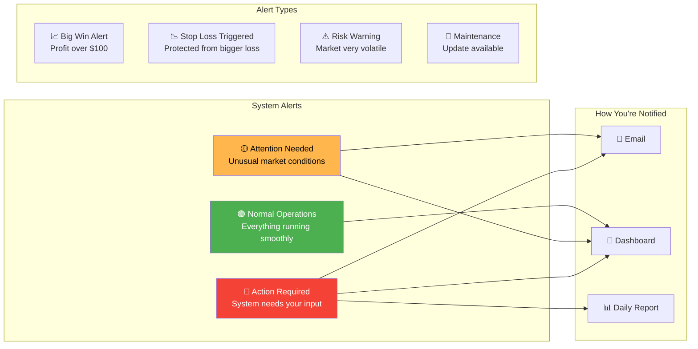

---

## 🎮 Control Panel - Your Options

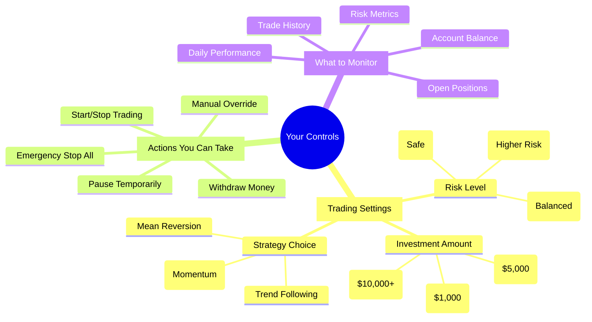

---

## 📊 Understanding Your Reports

```mermaid
graph TB
    subgraph "Daily Report Card"
        A[📅 Date: September 7, 2025]
        B[💰 Starting Balance: $10,000]
        C[💸 Ending Balance: $10,075]
        D[📈 Daily Gain: +$75 (+0.75%)]
        E[🎯 Trades Made: 3]
        F[✅ Winning Trades: 2]
        G[❌ Losing Trades: 1]
        H[📊 Win Rate: 67%]
        I[⚠️ Risk Level: LOW]
    end
    
    J[🎨 Visual Performance]
    J --> K[Green = Profitable Day ✅]
    J --> L[Red = Loss Day ❌]
    J --> M[Gray = No Trading Day ⏸️]
    
    style D fill:#4CAF50,color:#fff
    style H fill:#2196F3,color:#fff
    style I fill:#4CAF50,color:#fff
```

---

## 🚦 System Status Indicators

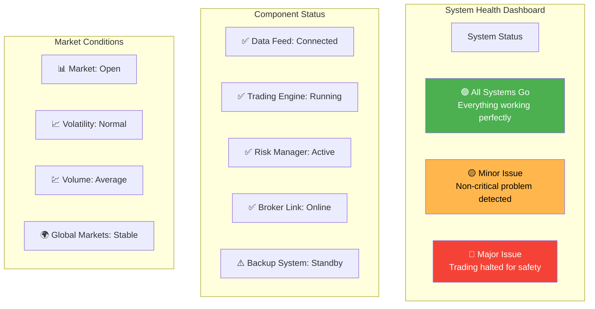

---

## 🎯 Success Metrics Visualization

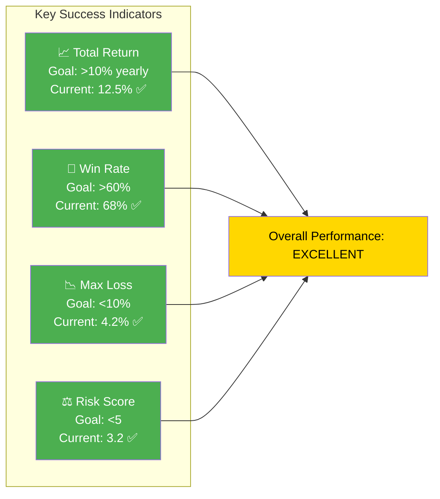

---

## 🔄 The Learning Process

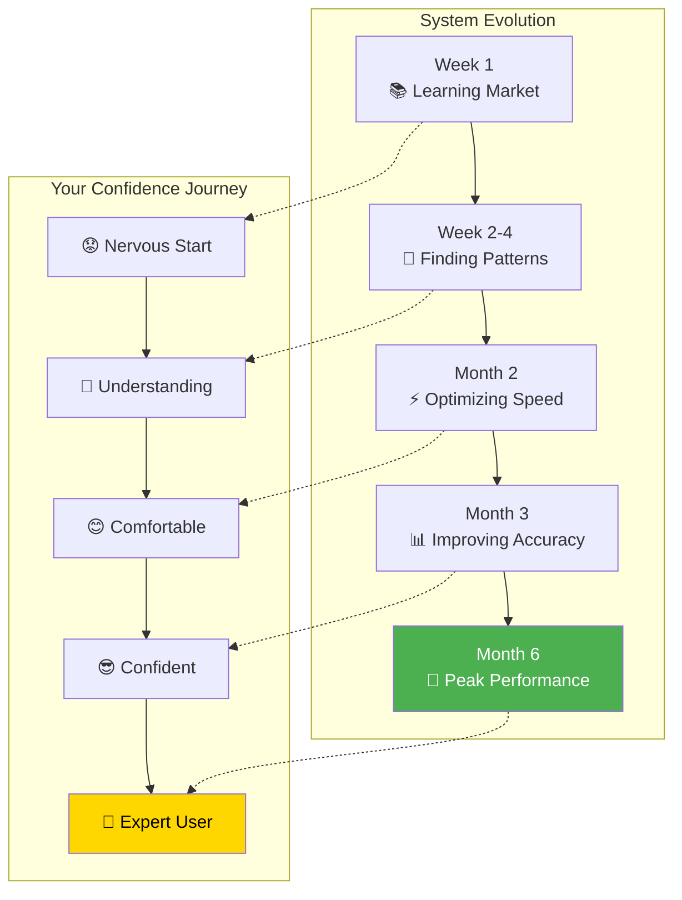

---

## 📱 Mobile vs Desktop View

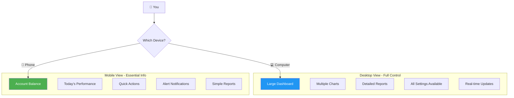

---

## 🌟 Feature Comparison

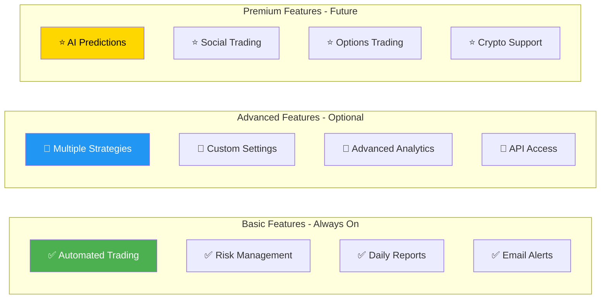

---

## 🎯 Final Visual Summary

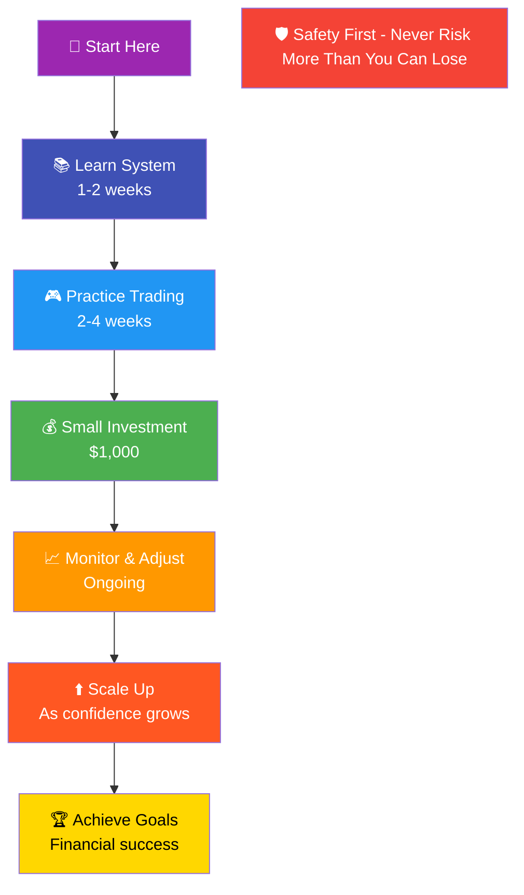

---

*These visual guides help you understand how the AI Trading System works without needing technical knowledge. Each diagram represents actual system components and processes in an easy-to-understand format.*

**Remember:** The colors in these diagrams have meaning:
- 🟢 **Green** = Good/Safe/Profitable
- 🔴 **Red** = Warning/Loss/Stop
- 🔵 **Blue** = Information/Process
- 🟡 **Yellow/Gold** = Caution/Success
- ⚪ **Gray** = Neutral/Waiting

---